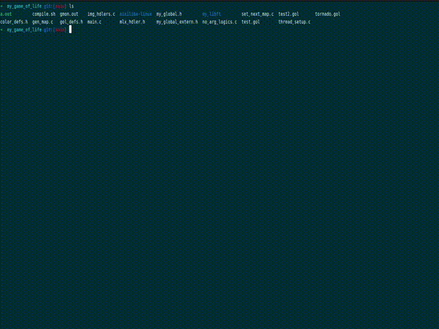

# Game of Life

[English](./README.md) | [한국어](./README.ko.md)

C와 MiniLibX로 구현한 Conway's Game of Life 시뮬레이터입니다.  
다음 세대는 순차적으로 계산하고, 배경·격자·셀 렌더링에는 POSIX 스레드를 사용합니다. 실행 중에는 셀과 색상 팔레트를 변경할 수 있습니다.



## 1. 주요 기능

- Conway's Game of Life 규칙에 따른 세대 갱신
- 8개 스레드를 이용한 배경·격자·셀 렌더링
- 랜덤 초기 맵 생성
- `.gol` 파일을 이용한 사용자 정의 초기 맵 로드
- 마우스를 이용한 실시간 셀 추가
- 12가지 색상 팔레트 전환

## 2. 프로젝트 배경

이 프로젝트는 다음 프로젝트를 구현하며 쌓은 그래픽 처리, 맵 파싱, 멀티스레딩 경험을 바탕으로 만들었습니다.

- [hoysong/cub3d](https://github.com/hoysong/cub3d) — MiniLibX를 활용한 그래픽 렌더링 및 이벤트 처리
- [hoysong/fdf_fil_de_fer](https://github.com/hoysong/fdf_fil_de_fer) — 맵 파일 파싱 및 화면 시각화
- [hoysong/philo](https://github.com/hoysong/philo) — POSIX 스레드와 뮤텍스를 이용한 동시성 제어

## 3. 실행 환경

이 프로젝트는 Linux와 X11 환경을 기준으로 작성되었습니다.

필요한 도구와 라이브러리는 다음과 같습니다.

- C 컴파일러(`cc`)
- `make`
- POSIX Threads
- X11 및 Xext 개발 라이브러리
- zlib 및 BSD 호환 라이브러리

Ubuntu/Debian 계열에서는 다음 명령으로 의존성을 설치할 수 있습니다.

```bash
sudo apt update
sudo apt install build-essential xorg libx11-dev libxext-dev zlib1g-dev libbsd-dev
```

## 4. 빌드

저장소를 받은 뒤 각 정적 라이브러리와 실행 파일을 순서대로 빌드합니다.

```bash
cd my_game_of_life
make -C my_libft
make -C minilibx-linux
sh compile.sh
```

빌드가 완료되면 현재 디렉터리에 `a.out`이 생성됩니다.

## 5. 실행

### 5.1 랜덤 맵으로 실행

인자 없이 실행하면 화면 크기에 맞춘 랜덤 맵을 생성합니다.

```bash
./a.out
```

### 5.2 맵 파일로 실행

초기 상태가 정의된 `.gol` 파일의 경로를 인자로 전달할 수 있습니다.

```bash
./a.out test.gol
```

저장소에는 `test.gol`, `test2.gol`, `tornado.gol` 예제가 포함되어 있습니다.

## 6. 조작법

| 입력 | 동작 |
| --- | --- |
| 마우스 이동 | 포인터 주변에 살아 있는 셀 추가 |
| `←` / `→` | 이전/다음 색상 팔레트 선택 |
| `Esc` | 프로그램 종료 |
| 창 닫기 버튼 | 프로그램 종료 |

## 7. 맵 파일 형식

맵 파일은 같은 길이의 문자열을 행 단위로 작성합니다.

- `0`: 죽은 셀
- `1`: 살아 있는 셀
- 모든 행의 길이는 같아야 합니다.

예를 들어 글라이더는 다음과 같이 표현할 수 있습니다.

```text
00000
01000
00100
11100
00000
```

맵의 가로·세로 크기에 셀 한 칸의 픽셀 크기를 곱한 값이 실행 창의 크기가 됩니다.

## 8. 주요 설정

다음 값은 헤더 파일에서 변경할 수 있습니다.

| 설정 | 위치 | 기본값 | 설명 |
| --- | --- | ---: | --- |
| `PIX_SIZE` | `gol_defs.h` | `5` | 셀 한 칸의 픽셀 크기 |
| `NUM_OF_THREADS` | `gol_defs.h` | `8` | 렌더링에 사용할 스레드 수 |
| `PALLETTE_COUNT` | `color_defs.h` | `12` | 사용할 수 있는 색상 팔레트 수 |

설정 변경 후에는 `sh compile.sh`로 실행 파일을 다시 빌드해야 합니다.

## 9. 프로젝트 구조

```text
.
├── README.md
├── README.ko.md
├── video.gif
└── my_game_of_life
    ├── main.c             # 프로그램 진입점과 입력 이벤트
    ├── set_next_map.c     # 다음 세대 계산
    ├── thread_setup.c     # 작업 스레드 설정
    ├── img_hdlers.c       # MiniLibX 기반 렌더링
    ├── gen_map.c          # 맵 파일 읽기
    ├── no_arg_logics.c    # 랜덤 맵 생성
    ├── color_defs.h       # 색상 팔레트
    ├── my_libft           # 공용 C 유틸리티 라이브러리
    └── minilibx-linux     # MiniLibX
```

## 10. Game of Life 규칙

각 셀의 다음 상태는 주변 8개 셀을 기준으로 결정됩니다.

1. 살아 있는 셀은 이웃이 2개 미만이면 죽습니다.
2. 살아 있는 셀은 이웃이 2개 또는 3개이면 생존합니다.
3. 살아 있는 셀은 이웃이 3개를 초과하면 죽습니다.
4. 죽은 셀은 이웃이 정확히 3개이면 살아납니다.
